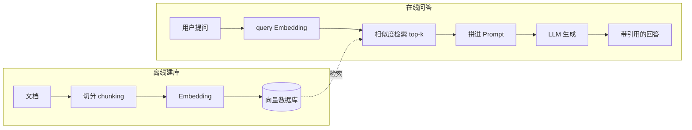
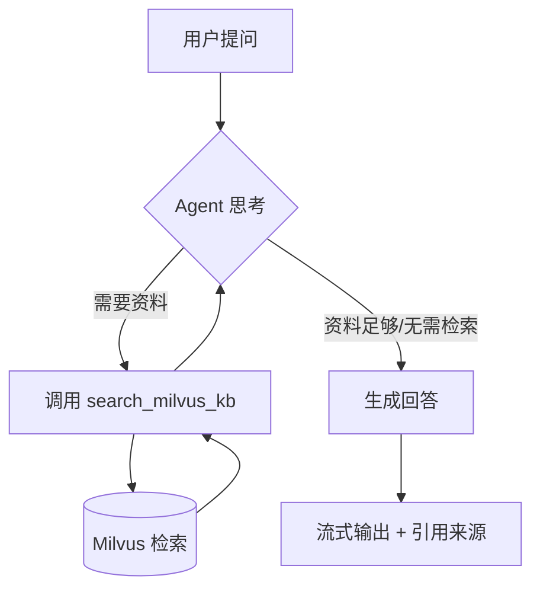

# RAG + Milvus 2.6 技术分享

> 面向「已经了解部分 RAG 概念」的开发者
> 时长：约 40 分钟｜配套代码：本仓库 `backend/` + `frontend/`

---

## 议程（40 分钟）

| # | 章节 | 时长 |
|---|---|---|
| 1 | 开场：为什么是 RAG + 向量库 | 3′ |
| 2 | RAG 是什么 & 它解决什么问题 | 8′ |
| 3 | 向量数据库与 Milvus 2.6 | 10′ |
| 4 | 动手：用 MilvusClient 玩转 Milvus | 7′ |
| 5 | 进阶：Agentic RAG（智能体 × 向量检索） | 8′ |
| 6 | 现场演示 | 3′ |
| 7 | 踩坑 / 总结 / Q&A | 1′+ |

> 👉 **带走三样东西**：① RAG 与向量检索的完整心智模型；② 能独立用 Milvus 2.6 + LangChain 1.x 搭一个 Agentic RAG；③ 避开我替你踩过的几个坑。

---

## 1. 开场（3′）

三个问题暖场：

- 「让 ChatGPT 回答公司内部报销流程」—— 它答不了，为什么？
- 「让大模型回答昨晚的新闻」—— 它不知道，为什么？
- 「让模型引用具体文档片段」—— 它做不到，为什么？

答案都指向同一件事：**模型的知识是冻结的、封闭的**。RAG 就是补这块板子的最主流方案，而**向量数据库**是 RAG 的「记忆中枢」。今天我们用 **Milvus 2.6** + **LangChain 1.x** 把整套链路走通。

---

## 2. RAG 是什么 & 它解决什么问题（8′）

### 2.1 LLM 的三块硬伤

| 硬伤 | 表现 | 根因 |
|---|---|---|
| **知识时效性** | 问新事件说不知道 | 训练数据有截止日期 |
| **幻觉** | 一本正经地编造 | 模型是概率生成，没有「事实校验」 |
| **私域知识** | 答不了内部文档 | 训练语料里没有 |

### 2.2 朴素 RAG 的两段式流程



一句话：**把检索到的相关文档作为「开卷资料」塞进 Prompt，让模型看着资料答题。**

### 2.3 为什么朴素 RAG 还不够？

朴素 RAG 是**固定管线**——不管问什么都先检索一次。这带来两个问题：

1. 「你好」「谢谢」这种闲聊，也去检索一次，浪费且答非所问；
2. 复杂问题一次检索不够，需要**改写 query、多轮检索、判断何时停止**。

这就引出了 **Agentic RAG**：把检索变成**智能体的一个工具**，由 LLM 自己决定调不调、调几次。

> 🎯 **本 demo 的核心命题**：用 LangChain 1.x 的 Agent + Milvus 实现一个 Agentic RAG。

---

## 3. 向量数据库与 Milvus 2.6（10′）

### 3.1 向量检索的直觉

文档被 embedding 模型转成几百到几千维的向量（语义坐标）。**语义相近的内容，向量在空间里也相近**。检索就是把问题也变向量，找「最近的」几条。

但维度高、数据量大时，**精确**最近邻代价爆炸。所以工业上用 **ANN（近似最近邻）**，牺牲一点点精度换巨大加速。

### 3.2 常见索引：HNSW

| 索引 | 思路 | 特点 |
|---|---|---|
| **Flat** | 暴力遍历 | 100% 准确，慢，仅小数据/演示 |
| **IVF** | 先聚类分桶，桶内细查 | 通用，可调 `nlist/nprobe` |
| **HNSW** | 分层小世界图 | **低延迟、高召回**，RAG 首选 |

HNSW 两个关键参数：
- 建索引：`M`（图连接度，默认 16）、`efConstruction`（建图质量，默认 256）
- 查询时：`ef`（越大越准越慢，默认 64）

### 3.3 Milvus 是什么

开源、云原生、分布式向量数据库，LF AI & Data 基金会项目。能扛亿级向量，支持多种索引、混合检索、动态 schema。是目前最主流的开源向量库之一。

### 3.4 Milvus 2.6 的新特性（重点）

| 特性 | 价值 |
|---|---|
| **内置 BM25 全文检索** | VARCHAR 文本自动转稀疏向量，不再需要外接稀疏模型；吞吐比 ES 高约 4× |
| **可空字段 + 默认值** | `nullable=True` / `default_value`，schema 更灵活 |
| **动态加字段** | `add_field`，不必为改 schema 重建集合 |
| **JSON Path / Flat Index** | JSON 元数据过滤提速约 100× |
| **空值感知过滤、更快的 COUNT(\*)** | 综合性能与成本优化 |

### 3.5 连接方式：MilvusClient（新）vs 旧 ORM

```python
# ✅ 2.6 推荐：MilvusClient（扁平、无全局状态、自带异步）
from pymilvus import MilvusClient
client = MilvusClient(uri="http://localhost:19530")  # 或本地 "./milvus.db"

# ⚠️ 旧 ORM 风格（仍兼容，不建议新代码用）
from pymilvus import connections, Collection
connections.connect(alias="default", uri="http://localhost:19530")
```

### 3.6 本地最快上手：milvus-lite

通过 `pymilvus[milvus-lite]`（本仓库已在 `backend/pyproject.toml` 声明，`uv sync` 自动装上），把 `uri` 指向一个本地文件，进程内嵌运行，**零运维**。注意它只支持 Flat 索引，生产规模请上 Docker standalone（见仓库 `docker-compose.yml`）。

---

## 4. 动手：用 MilvusClient 玩转 Milvus（7′）

> 走读 `backend/app/milvus_raw.py`。完整可跑，`uv run python -m app.milvus_raw`。

### 4.1 连接

```python
from pymilvus import MilvusClient
client = MilvusClient(uri="./milvus_demo.db")   # milvus-lite 单文件
```

### 4.2 建 schema + HNSW 索引

```python
from pymilvus import DataType

schema = MilvusClient.create_schema(auto_id=True, enable_dynamic_field=False)
schema.add_field("id", DataType.INT64, is_primary=True)
schema.add_field("vector", DataType.FLOAT_VECTOR, dim=8)
schema.add_field("text", DataType.VARCHAR, max_length=512, nullable=True)  # 2.6 可空

index_params = client.prepare_index_params()
index_params.add_index(
    field_name="vector",
    index_type="HNSW",
    metric_type="COSINE",
    params={"M": 16, "efConstruction": 256},
)

client.create_collection("demo", schema=schema, index_params=index_params)
```

> 💡 讲三个点：① `auto_id` 让 Milvus 自动生成主键；② `nullable=True` 是 2.6 新特性；③ 一次 `create_collection` 同时建表+建索引。

### 4.3 插入 + 加载 + 检索

```python
client.insert("demo", data=[
    {"vector": [0.1]*8, "text": "Milvus 是向量数据库"},
    {"vector": [0.9]*8, "text": "HNSW 是常用索引"},
])
client.load_collection("demo")

res = client.search(
    collection_name="demo",
    data=[[0.5]*8],
    anns_field="vector",
    limit=3,
    output_fields=["text"],
    search_params={"params": {"ef": 64}},
)
```

> 💡 `load_collection` 把索引载入内存才能查；`output_fields` 控制回带哪些标量字段。

---

## 5. 进阶：Agentic RAG（8′）

> 走读 `backend/app/agent.py` + `backend/app/vectorstore.py` + `backend/app/ingest.py`。

### 5.1 三种 RAG 形态对比

| 形态 | 检索触发 | 检索次数 | 灵活性 |
|---|---|---|---|
| 朴素 RAG | 固定先检索 | 1 次 | 低 |
| Retriever 链 | 规则/查询路由 | 少量 | 中 |
| **Agentic RAG** | **Agent 自主决策** | **按需多次** | 高 |

### 5.2 关键一步：把检索做成工具

LangChain 1.x 的标准写法是 `@tool` 装饰器 + `create_agent`：

```python
# backend/app/agent.py（节选）
from langchain.agents import create_agent
from langchain.tools import tool

@tool(response_format="content_and_artifact")
def search_milvus_kb(query: str):
    """在 Milvus 知识库中检索与问题最相关的片段。"""
    docs = get_vectorstore().similarity_search(query, k=4)
    serialized = "\n\n".join(f"[来源 #{i+1}]\n{d.page_content}" for i, d in enumerate(docs))
    return serialized, docs   # (给模型的文本, 给应用层的原始文档)

agent = create_agent(model=llm, tools=[search_milvus_kb], system_prompt=PROMPT)
```

> 💡 **`response_format="content_and_artifact"` 是点睛之笔**：
> - 模型只看到 `serialized`（干净文本），不会被文档元数据干扰；
> - 应用层（FastAPI）能拿到 `docs`，于是前端可以展示**引用来源**——这是 RAG 体验的关键。

### 5.3 Agent 的运行循环



Agent 可以：**一次不检索**（闲聊）、**检索一次**（普通问题）、**多次检索**（复杂问题，改写 query 再查）。

### 5.4 1.x vs 旧 API 速查

| 旧（0.x / 早期） | 新（LangChain 1.x） |
|---|---|
| `from langchain_core.tools import tool` | `from langchain.tools import tool` |
| `langgraph.prebuilt.create_react_agent` | `from langchain.agents import create_agent` |
| `create_retriever_tool(retriever, ...)` | `@tool(response_format="content_and_artifact")` |
| `init_chat_model` 或手搓 | 同样支持，也可直接 `ChatOpenAI` |

> 📌 新项目直接用 `create_agent` + `@tool`，更简洁、更贴近 1.x 官方推荐。

### 5.5 流式输出到前端（SSE）

后端用 `agent.astream(..., stream_mode="messages")` 拿到逐 token 的流，包成 SSE（`event: token` / `event: sources` / `event: done`）。前端用 `ReadableStream` 解析、逐字渲染。代码见 `backend/app/main.py` 与 `frontend/components/ChatBox.tsx`。

---

## 6. 现场演示（3′）

```bash
# 终端 1：后端
cd backend && uv sync && uv run python -m app.ingest
uv run uvicorn app.main:app --reload --port 8000

# 终端 2：前端
cd frontend && yarn install && yarn dev
```

打开 http://localhost:3000，依次问：
1. 「Milvus 2.6 有什么新特性？」→ 看 Agent 调用工具、流式回答、下方引用来源
2. 「你好」→ 看 Agent **不调用**工具，直接回答（Agentic 的体现）
3. 「HNSW 的 ef 参数怎么调？」→ 看检索 + 引用

---

## 7. 踩坑 / 总结 / Q&A（1′+）

### 🕳️ 踩过的坑

1. **pymilvus 2.6.16 的 ConnectionManager 坑**
   2.6.16 起，`MilvusClient` 内部用新的 ConnectionManager 管理 alias，而 `langchain-milvus` 内部混用了旧的 `connections` ORM，会抛 `ConnectionNotExistException`（[milvus#48641](https://github.com/milvus-io/milvus/issues/48641)）。**解法**：pin `pymilvus==2.6.12`。

2. **embedding 维度必须严格一致**
   智谱 `embedding-3` 默认 2048 维。建集合的 `dim` 与实际向量维度、检索向量维度三者必须完全相同，否则报错。

3. **milvus-lite 的局限**
   只支持 Flat 索引（HNSW 写了也会降级），仅 macOS/Linux、Python 3.10+。需要完整能力请上 Docker standalone。

4. **LangChain 1.x 的 import 变了**
   `create_react_agent` / `create_retriever_tool` 等旧 API 虽然还能用，但 1.x 推荐 `langchain.agents.create_agent` + `langchain.tools.tool`。照着 0.x 教程抄会踩雷。

### ✅ 一页总结

- **RAG** = 检索 + 生成，解决 LLM 时效/幻觉/私域三大硬伤
- **向量库** = 语义检索引擎；**Milvus 2.6** 是主流开源选项，新特性里 BM25 内置 + nullable 最实用
- **Agentic RAG** = 把检索做成 Agent 工具，由 LLM 自主决策；LangChain 1.x 用 `create_agent` + `@tool` 实现
- **本 demo** = Next.js 前端 ↔ FastAPI（SSE）↔ LangChain Agent ↔ Milvus，全链路可跑

### 🚀 延伸学习

- 进阶检索：混合检索（dense + sparse/BM25）、rerank、query 改写
- 规模化：Docker standalone → K8s 集群、分区、分片
- 评估：Ragas / LangSmith 测检索召回率与生成忠实度
- Milvus 官方文档：https://milvus.io/docs
- LangChain 1.x 文档：https://docs.langchain.com

---

## 附录 A：关键版本

| 组件 | 版本 |
|---|---|
| Milvus（服务器/lite） | 2.6.12 |
| pymilvus | 2.6.12（刻意不升 2.6.16） |
| langchain-milvus | 0.3.x |
| langchain | 1.x |
| Next.js | 15 |
| 智谱 LLM / Embedding | glm-4.6 / embedding-3（2048 维） |

## 附录 B：代码地图

| 你想看… | 打开… |
|---|---|
| Milvus 原生用法 | `backend/app/milvus_raw.py` |
| 文档切分入库 | `backend/app/ingest.py` |
| 向量库封装 | `backend/app/vectorstore.py` |
| **Agentic RAG 核心** | `backend/app/agent.py` |
| SSE 流式接口 | `backend/app/main.py` |
| 聊天 UI | `frontend/components/ChatBox.tsx` |
